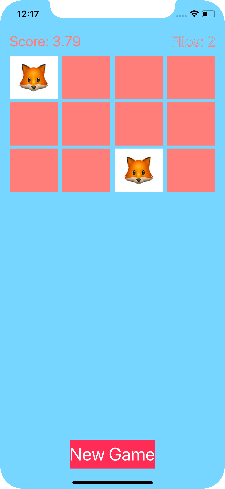
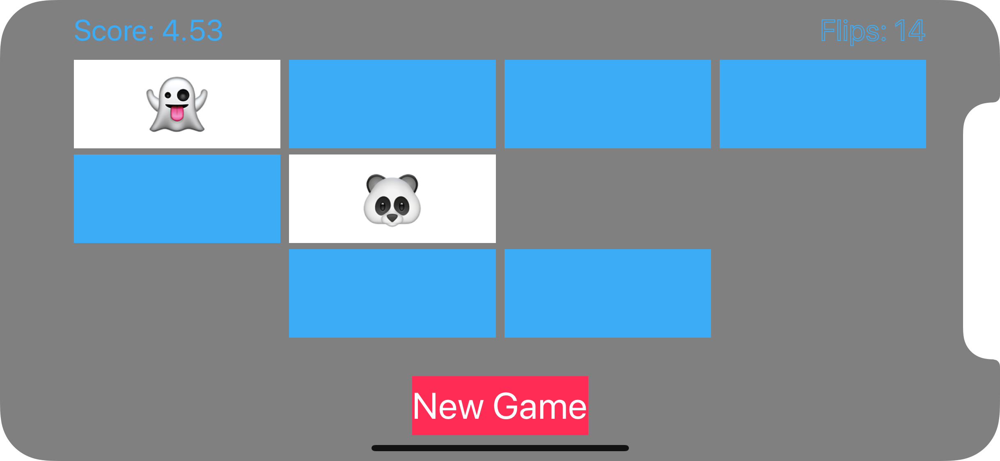

# Stanford-CS139p

My [Stanford CS193p](https://cs193p.sites.stanford.edu) iPhone Application Development ([Winter 2017](https://itunes.apple.com/us/course/developing-ios-11-apps-with-swift/id1309275316)) assignments solutions.

## Concentration

The goal of this assignment is to recreate the *Concentration* game demonstration given in lecture and then make some small enhancements.

<p align="center">
    
    
</p>

### Things to learn

- Swift
- MVC
- ```UIViewController``` subclass
- ```UILabel``` and ```UIButton```
- Target/Action (```@IBAction```)
- Outlets (```@IBOutlet```) and Outlet Collections functions and properties (instance variables) ```let``` versus ```var```
- ```didSet```
- ```for in``` (and ```..<CountableRange``` syntax)
- ```Array<Element>``` and ```Dictionary<Key, Value>```
- ```[Element]``` and ```[Key: Value]``` syntax
- Initialization of struct and class
- ```viewDidLoad```
- Optionals (including implicitly-unwrapped Optionals)
- ```??``` optional defaulting operator
- ```// TODO```
- ```arc4random()```
- Type conversion (e.g. from ```UInt``` to ```Int```)
- ```StackView``` and (simple) Autolayout

## Set V1

The goal of this assignment is to implement a game of solo (i.e. one player) [Set](https://en.wikipedia.org/wiki/Set_(card_game)) completely from scratch by myself.

<p align="center">
    
    
</p>

### Things to learn

- All the things from Assignment 1, but from scratch this time. 
- Closures
- ```extension```
- Using ```struct``` to declare constants
- ```Equatable```
- ```enum```
